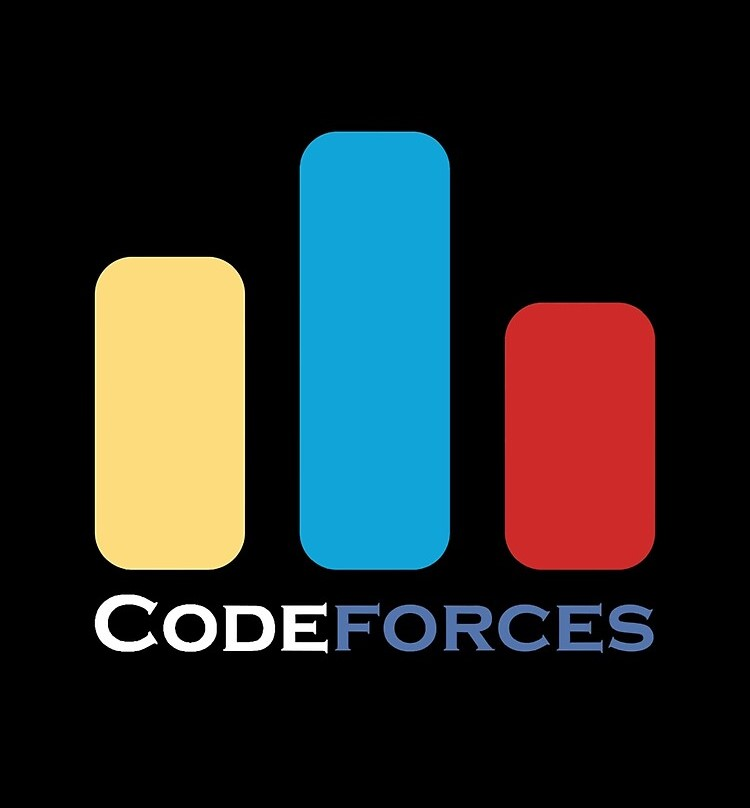
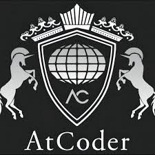

<h2 align="center"><samp>Hi 👋 I'm Abd Alrzaq Najieb</samp></h2>

  

<h3 align="center">🚀 About Me</h3>

<ul>
  <li>🧠 <strong>Currently Learning:</strong> Artificial Intelligence and Microservices Architecture </li>
  <li>💻 <strong>Specialties:</strong> Back-end development .</li>
  <li>💡 <strong>Interests:</strong> Software engineering, AI, and Competitive programming.</li>
  <li>📍 <strong>Location:</strong> Based in Damascus, Syria.</li>
  <li>📄 <strong>My Resume :</strong> <a href="https://github.com/ABDALRZAQ345/ABDALRZAQ345/raw/master/Abd_Alrzaq_Cv.pdf" target="_blank">take a look </a></li>
</ul>

<h3 align="center"><samp>✨ Languages and Tools ✨</samp></h3>

  <table>
    <tr>
      <td align="center">
        
         <small>PHP</small>
      </td>
      <td align="center">
        
         <small>C++</small>
      </td>
      <td align="center">
        
         <small>HTML</small>
      </td>
      <td align="center">
        
         <small>Java</small>
      </td>
      <td align="center">
        
         <small>Docker</small>
      </td>
    </tr>
    <tr>
      <td align="center">
        
         <small>Laravel</small>
      </td>
      <td align="center">
        
         <small>OpenGL</small>
      </td>
      <td align="center">
        
         <small>Git</small>
      </td>
      <td align="center">
        
         <small>GitHub</small>
      </td>
      <td align="center">
        
         <small>MySQL</small>
      </td>
    </tr>
    <tr>
      <td align="center">
        
         <small>Postman</small>
      </td>
      <td align="center">
        
         <small>Linux</small>
      </td>
      <td align="center">
        
         <small>Three.js</small>
      </td>
     <td align="center">
        
         <small>C#</small>
      </td>
      <td align="center">
        
         <small>RabbitMq</small>
      </td>
  </table>

<h3 align="center"><samp>🔗 Accounts</samp></h3>

  <table>
    <tr>
      <td align="center" width="100">
        
         LinkedIn
      </td>
      <td align="center" width="100">
        
         GitHub
      </td>
      <td align="center" width="100">
        
         Codeforces
      </td>
      <td align="center" width="100">
        
         AtCoder
      </td>
      <td align="center" width="100">
        
         Medium
      </td>
    </tr>
  </table>

<h3 align="center">📊 GitHub Stats:</h3>

   
  

<h4 align="center">Open to collaboration, learning, and challenges</h4>
